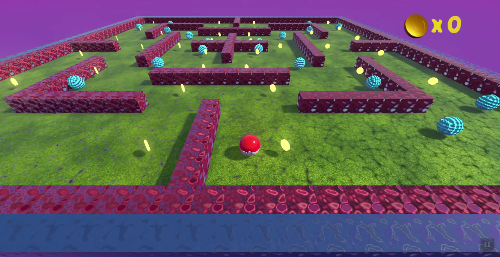
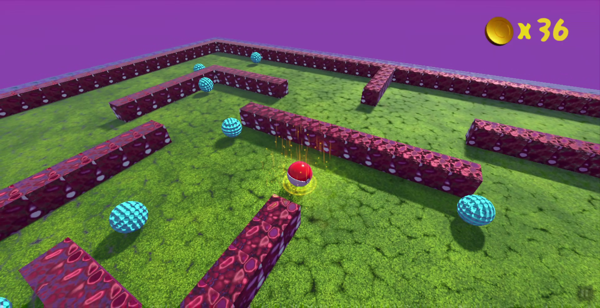

  

  <h3 align="center">Being Ball</h3>

  

    A 3D Ball game
     
    
  

## About The Project

Being Ball is a 3D game that is developed using Godot Game Engine which uses gdscript to write game logic. 

## Technology Stack

* [Godot](https://godotengine.org/)
* [gdscript](https://docs.godotengine.org/en/stable/getting_started/scripting/gdscript/gdscript_basics.html)
